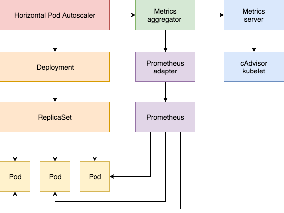

# Horizontal Pod Autoscaler

## 1. 概述

HPA：Pod 水平自动伸缩

**HPA 通过监控分析一些控制器控制的所有 Pod 的负载变化情况来确定是否需要调整 Pod 的副本数量**

具体如下图所示：




## 2. 算法

**比如CPU 超过 50% 就扩容，指的是 超过请求量的50%。**

```yaml
apiVersion: apps/v1
kind: Deployment
metadata:
  name: php-apache
spec:
  selector:
    matchLabels:
      run: php-apache
  replicas: 1
  template:
    metadata:
      labels:
        run: php-apache
    spec:
      containers:
      - name: php-apache
        image: k8s.gcr.io/hpa-example
        ports:
        - containerPort: 80
        resources:
          limits:
            cpu: 500m
          requests:
            cpu: 200m
```

如这个 yaml 文件 CPU request 为 200m，如果 HPA 设置为 CPU 50%。

则当前 Pod CPU 超过 200m*50%=100m 就会产生扩容，反之会缩容。


### 算法细节

```
期望副本数 = ceil[当前副本数 * (当前指标 / 期望指标)]
```

例如，当前度量值为 `400m`，目标设定值为 `200m`，那么由于 `400.0/200.0 == 2.0`， 副本数量将会翻倍。 如果当前指标为 `100m`，副本数量将会减半，因为`100.0/100.0 == 0.5`。 如果计算出的扩缩比例接近 1.0 （根据`--horizontal-pod-autoscaler-tolerance` 参数全局配置的容忍值，默认为 0.1）， 将会放弃本次扩缩。

如果创建 HorizontalPodAutoscaler 时指定了多个指标， 那么会按照每个指标分别计算扩缩副本数，取最大值进行扩缩。 

### 冷却

当使用 Horizontal Pod Autoscaler 管理一组副本扩缩时， 有可能因为指标动态的变化造成副本数量频繁的变化，有时这被称为 *抖动（Thrashing）*。

从 v1.6 版本起，集群操作员可以调节某些 `kube-controller-manager` 的全局参数来 缓解这个问题。

从 v1.12 开始，算法调整后，扩容操作时的延迟就不必设置了。

- `--horizontal-pod-autoscaler-downscale-stabilization`: `kube-controller-manager` 的这个参数表示缩容冷却时间。 即自从上次缩容执行结束后，多久可以再次执行缩容，默认时间是 5 分钟(`5m0s`)。


## 参考

`https://segmentfault.com/a/1190000018141551`

`https://kubernetes.io/zh/docs/tasks/run-application/horizontal-pod-autoscale-walkthrough/`

`https://kubernetes.io/zh/docs/tasks/run-application/horizontal-pod-autoscale/`