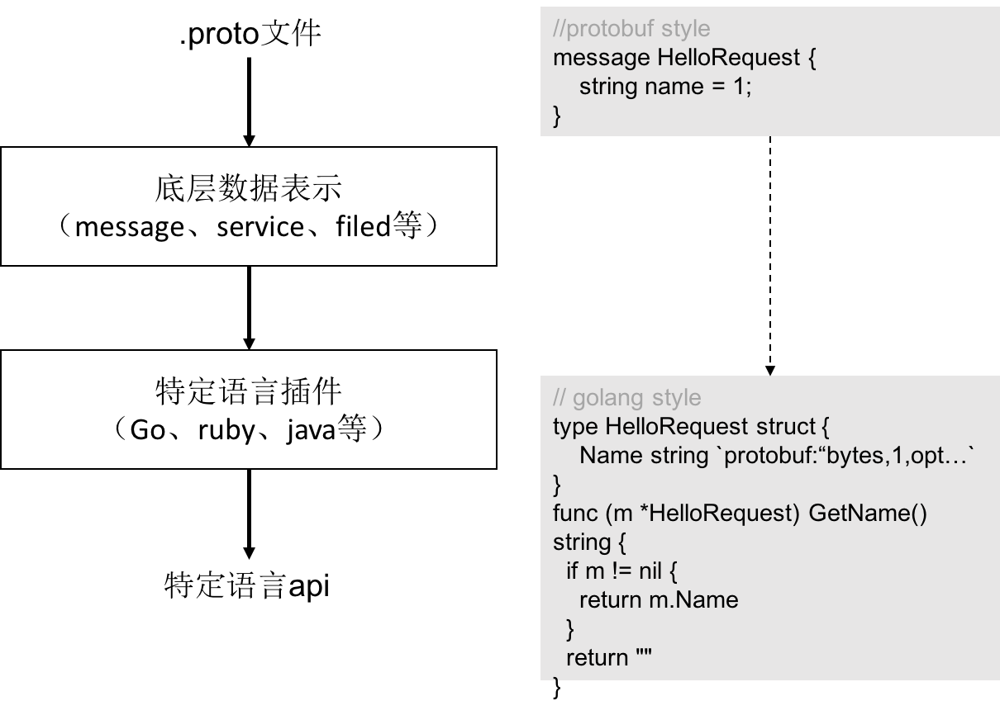

# Protobuf 使用

## 1. 概述

**Protocol buffers** 是一种语言无关、平台无关的可扩展机制或者说是**数据交换格式**，用于**序列化结构化数据**。与XML、json相比，Protocol buffers 序列化后的码流更小、速度更快、操作更简单。

> Protocol buffers are a language-neutral, platform-neutral extensible mechanism for serializing structured data.


## 2. Protocol Compiler

protoc 用于编译 protocolbuf (.proto文件) 和 protobuf 运行时。

> protoc 是 C++ 写的，比较简单的安装方式是直接下载编译好的二进制文件。

release 版本下载地址如下

```json
https://github.com/protocolbuffers/protobuf/releases
```

> 下载操作系统对应版本然后解压然后配置一下环境变量即可。

比如`windows`就下载`protoc-3.14.0-win64.zip` 然后把解压后的`xxx\protoc-3.14.0-win64\bin`配置到环境变量。

`linux`则下载`protoc-3.14.0-linux-x86_64.zip`

解压

```sh
$ unzip protoc-3.14.0-linux-x86_64.zip -d protoc-3.14.0-linux-x86_64
```

新增环境变量

```shell
$ sudo vim /etc/profile 
```

增加如下内容

```shell
#记得改成自己的路径
export PATH=$PATH:/home/lixd/17x/protoc-3.14.0-linux-x86_64/bin
```

使其生效

```shell
$ source /etc/profile
```


查看是否安装成功

```sh
$ protoc --version
libprotoc 3.14.0
```

## 3. Go Plugins

出了安装 protoc 之外还需要安装各个语言对应的编译插件，我用的 Go 语言，所以还需要安装一个 Go 语言的编译插件。

```sh
go get google.golang.org/protobuf/cmd/protoc-gen-go
```


## 4. Demo

### 1. 创建.proto 文件

`derssbook.proto`

```protobuf
//声明proto的版本 只能 是3，才支持 gRPC
syntax = "proto3";
//package 声明 包名 golang对包名比较严格 所以这里需要指定一下
package helloworld;

// service 定义一个服务
service Hello {
    // rpc 定义一个rpc调用方法
    rpc SayHello (HelloReq) returns (HelloRep) {
    }
}

//  message 类似于struct
// request
message HelloReq {
    string name = 1;
}

//  response
message HelloRep {
    string message = 1;
}

```

### protoc 编译

**编译命令**

```sh
# Syntax: protoc [OPTION] PROTO_FILES
$ protoc --proto_path=IMPORT_PATH  --go_out=OUT_DIR  --go_opt=paths=source_relative path/to/file.proto
```

这里简单介绍一下 golang 的编译姿势:

- **--proto_path或者`-I`** ：指定 import 路径，可以指定多个参数，编译时按顺序查找，不指定时默认查找当前目录。
  - .proto 文件中也可以引入其他 .proto 文件，这里主要用于**指定被引入文件的位置**。
- **--go_out**：golang编译支持，指定输出文件路径
  - 其他语言则替换即可，比如`--java_out`等等
- **--go_opt**：指定参数，比如`--go_opt=paths=source_relative`就是表明生成文件输出使用相对路径。
- **path/to/file.proto** ：被编译的 .proto 文件放在最后面

```shell
$ protoc --go_out=. hello_word.proto
```

编译后会生成一个`hello_word.pb.go`文件。

到此为止就ok了。

## 5. 编译过程

可以把 protoc 的编译过程分成简单的两个步骤：

* 1）解析 .proto 文件，编译成 protobuf 的原生数据结构在内存中保存；
* 2）把 protobuf 相关的数据结构传递给相应语言的**编译插件**，由插件负责根据接收到的 protobuf 原生结构渲染输出特定语言的模板。

具体过程如图所示：



protoc 中原生包含了部分语言（java、php、python、ruby等等）的编译插件，但是没有 Go 语言的，所以需要额外安装一个插件。

> 具体原生支持见源码`https://github.com/protocolbuffers/protobuf/blob/master/src/google/protobuf/compiler/main.cc`

同样的，后续讲到的 gRPC Plugins、gRPC-Gateway 也是一个 protoc 编译插件，将 .proto 文件编译成对应模块需要的源文件。

## 6. 参考

`https://developers.google.com/protocol-buffers`

`https://github.com/protocolbuffers/protobuf`

`https://studygolang.com/articles/12673`