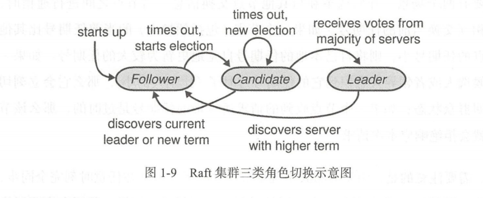

# 分布式系统与一致性协议


## 1. CAP原理

**C：Consistency**

即一致性，访问所有的节点得到的数据应该是一样的。**注意**，这里的一致性指的是`强一致性`，也就是数据更新完，访问任何节点看到的数据完全一致，要和弱一致性，最终一致性区分开来。

**A：Availability**

即可用性，所有的节点都保持高可用性。**注意**，这里的高可用还包括`不能出现延迟`，比如如果节点B由于等待数据同步而阻塞请求，那么节点B就不满足高可用性。

也就是说，任何没有发生故障的服务必须在有限的时间内返回合理的结果集。

**P：Partiton tolerence**

即分区容忍性，这里的分区是指网络意义上的分区。由于网络是不可靠的，所有节点之间很可能出现无法通讯的情况，在节点不能通信时，要保证系统可以继续正常服务。

> 以实际效果而言，分区相当于对通信的时限要求。系统如果不能在时限内达成数据一致性，就意味着发生了分区的情况，必须就当前操作在C和A之间做出选择

CAP原理说，一个**数据分布式系统**不可能同时满足C和A和P这3个条件。所以系统架构师在设计系统时，不要将精力浪费在如何设计能满足三者的完美分布式系统，而是应该进行取舍。由于网络的不可靠性质，大多数开源的分布式系统都会实现P，也就是分区容忍性，之后在C和A中做抉择。


* `CP`:满足CP的系统，在出现网络分区(P)情况时为了满足一致性(C)就只能阻塞请求以等待数据同步，即不满足高可用(A)。
* `AP`:在出现网络分区(P)情况时为了满足高可用(A)就只能使用节点本地数据，那么就无法满足一致性(C)。
* `CA`:如果不存在网络分区，那么高可用(A)和一致性(C)是可以同时满足的。


## 2. 一致性

一致性协议是在复制状态机(Replication State Machine RMS)背景下提出来的。


### 1. 一致性模型

### 1.1 以数据为中心的一致性模型

#### 1. 严格一致性

也称强一致性，原子一致性或可线性化，是要求最高的一致性模型。

具体要求如下:

* 1.任何一次读写都能督导某一个数据的最近一次写的数据。
* 2.系统中所有进程看到的操作顺序都与`全局时钟`下的顺序一致

> 单机下都满足严格一致性 但是分布式环境下由于全局时钟问题 导致很难实现

#### 2. 顺序一致性

也称为可序列化，比严格一致性要求弱一点，但也是能够实现的最高级别的一致性模型。

> 放弃了全局时钟改为分布式逻辑时钟实现。

顺序一致性指所有的进程都以相同的顺序看到所有的修改。

读操作未必能及时获取到此前其他进程对同一数据的更新，但是每个进程读到的该数据不同值的顺序却是一致的。

> 即让系统中所有进程达成自己认为的一致就行了，错的话一起错，对的话一起对。


#### 3. 因果一致性

`happen-before`关系及其传递闭包

`因果关系`可以描述成如下情况:

* 本地顺序：本进程中事件的执行顺序即为本地因果顺序
* 异地顺序：如果读操作返回的是写操作的值，那么该写操作在顺序上一定在读操作之前
* 闭包传递：如果a-->b且b-->c，那么肯定有a-->c

否则操作之间的关系为`并发关系`。

* 对于具有潜在因果关系的写操作，所有进程看到的执行顺序相同
* `并发`写操作在不同主机上被看到的顺序`可以不同`

>  不严格地说，因果一致性弱于顺序一致性。


腾讯朋友圈即使用的因果一致性。

假设A发了朋友圈，内容为某个雪山的图。

B进行评论：这是哪里?

C对A进行评论：好美呀。

D对B的评论进行回复:这是梅里雪山。


显然D回复B的评论，所以D肯定在B评论之后 这是一个因果关系，所以顺序必须一致。

但是D的回复和C的评论并没有因果关系，所以可以顺序不一致。


#### 4. 可串行化一致性

如果说操作的历史等同于以某种单一原子顺序发生的历史，但对调用和完成时间没有说明，那么就可以称为可串行化的一致性模型。
这个模型一致性要么很强要么很弱。

很弱
```c
x=1
x=x+1
puts x
```

由于可以按照任意顺序进行所以可能会打印出`nil`、`1`或者`2`

很强

```c
print x if x = 3
x = 1 if x = nil
x = 2 if x = 1
x = 3 if x = 2
```

这样的话最后打印的x肯定是3了。

### 1.2 以用户为中心的一致性模型

很多时候并不需要系统内所有数据都保持一致，有时候可能只需要基于这个用于满足一致性即可。

#### 1. 最终一致性

最终一致性指在一定时间后所有副本最终都能够达到一致性。

> 例如CDN，图片更新后，用户在延迟一段时间后最终也会看到这个更新。


### 2. 复制状态机

复制状态机在分布式领域是一个常用且重要的技术，**通过复制服务副本，并和副本一起来协调客户端的交互，来实现容错服务**。

#### 1. 理论基础

复制状态机的理论基础是：

如果集群里的每一个节点上都运行着相同的确定性状态机S，并且所有的状态机刚开始都处于**同样的初始状态**s0。

那么给予这些状态机**相同的输入序列**: {i1, i2, i3, i4, i5, i6, …, in}, 这些状态机必然会经过相同的状态转换路径: s0->s1->s2->s3->…->sn。

最终达到**相同的状态**sn, 同时生成**相同的输出序列**, o3(s3), …, on(sn)}。

#### 2. 例子

状态机复制在实际应用中的一个例子就是`MySQL集群`。我们知道，MySQL集群中的master会把所有的操作记录到binlog中，这里的操作就是输入序列I, 然后slave会把master上的binlog复制到自己的relaylog中，然后把把relaylog里的操作回放一遍（相当于执行了一遍输入序列I）。所以，如果master和slave里的状态机是完全相同的，并且在执行序列I之前都处于相同的状态下，那么执行完序列I后，它们的状态依旧是相同的（一致性）。

**强、弱一致性**

在执行输入序列I的过程中，根据同步方式的不同，系统就有了强一致性和最终一致性。如果我们要求对于序列I中的每一个in, 都需要**所有的服务副本确认成功执行了in，才能执行in+1，那么这个系统就是强一致性的系统**。如果我们取消掉这个限制，仅仅要求所有的服务副本执行相同的输入序列***I\***，但是完全各自独立执行，而不需要在中间同步，那么就有了最终一致性（各服务都会达到相同的最终状态，但是达到的时间不确定）。


### 3. 拜占庭将军问题

拜占庭将军问题是一个**共识**问题。

> 在很久很久以前，拜占庭是东罗马帝国的首都。那个时候罗马帝国国土辽阔，为了防御目的，因此每个军队都分隔很远，将军与将军之间只能靠信使传递消息。
>
> 在打仗的时候，拜占庭军队内所有将军必需达成**一致的共识**，才能更好地赢得胜利。但是，在军队内有可能存有叛徒，扰乱将军们的决定。
>
> 这时候，在已知有成员不可靠的情况下，其余忠诚的将军需要在不受叛徒或间谍的影响下达成一致的协议。


Fred Schneider 在前面提到的那篇论文中指出了这样一个基本假设：

**一个RSM系统要容忍N个拜占庭错误，至少需要 2N+1个复制节点**。
如果只是把错误的类型缩小到进程失败，则至少需要 `N+1` 个复制节点才能容错

综上所述，对于 个通用的、具有复制状态机语义的分布式系统，如果要做到N个节点的容错，理论上最少需要 2N+1 个复制节点。这也是典型的一致性协议都要求半数以上（ N/2+ 1 ）的服务器可用才能做出一致性决定的原因

> 如，在一个5节点的服务器集群中要求至少其中3个可用；如果小于 个可用，则会无法保证返回一致的结果


### 4. FLP不可能性

FLP不可能性（ FLP Impossibility, 个字母分别代表三个作者Fischer Lynch Patterson 名字的首字母）是分布式领域中一个非常著名的定理（能够在计算机科学领域被称为“定理”，可见其举足轻重的地位），该定理给出了一个令人吃惊的结论：

> No completely asynchronous consensus protocol can tolerate even a single unannounced process death.

在异步通信场景下，任何一致性协议都不能保证，即使只有一个进程失败，其他`非失败进程`也不能达成一致。

例子：

> 甲、乙、丙 个人各自分开进行投票（投票结果是0或1）。 他们彼此可以通过电话进行沟通，但有人会睡着 例如：甲投票 0，乙投票1 ，这时候甲和乙打平，丙的选票就很关键 然而丙睡着了，在他醒来之前甲和乙都将无法达成最终的结果。即使重新投票，也有可能陷入无尽的循环之中。


**FLP 定理实际上说明了在允许节点失效的场景下，基于异步通信方式的分布式协议，无法确保在有限的时间内达成一致性。**

换句话说，结合 CAP 理论和上文提到的一致式算法正确性衡量标准，一个正确的一致性算法，能够在异步通信模型下(P)同时保证 一致性(C)和可终止性(A)一一这显然是做不到的！


## 3. Paxos协议


## 4. Raft协议

Paxos协议难以理解，同时实现也比较困难，于是研究出了Raft算法。

**问题分解**

Raft算法把问题分解成了如下几个部分:

* **领袖选举(leader election)**:在一个领袖节点故障后必须重新选出一个新的领袖节点

* **日志复制**:领袖节点从客户端接收操作请求，然后将操作日志复制到集群中的其他服务器上，并且强制要求其他服务器的日志必须和自己的保持一致。

* **安全性**：Raft 关键的安全特性是下文提到的状态机安全原则（ State 

  Machine Safety）如果一个服务器已经将给定索引位置的日志条目应用到状态机中，则所有其他服务器不会在该索引位置应用不同的条。

* **成员关系变化**：配置发生变化的时候，集群能够继续工作。


**减少状态空间**

Raft 算法通过减少需要考虑的状态数量来简化状态空间，这将使得整个系

统更加一致并且能够尽可能地消除不确定性。


#### 1. Raft算法基本概念

一般情况下，分布式系统中存在如下两种节点关系模型：

* 对称 所有节点都是平等的，不存在主节点 客户端可以与任意节点进行交互 。
* 非对称 基于选主模型，只有主节点拥有决策权。任意时刻有且仅有一 个主节点，客户端只与主节点进行交互 。


Raft协议采用的是非对称节点关系模型 。

包含三类角色：

* Leader(领袖)
* Candidate(候选人)
* Follower(群众)


开始没有Leader都是Candidate，于是开始某一位候选人得到半数以上的投票就出任那一届的领袖。其他所有人都回到Follower身份。


Raft中将时间划分成为任意个不同长度的任期(Term)，是单调递增的。每次任期只能选出一个Leader，选取失败则进入下一任期重新开始选取。
> 所以某些任期会没有Leader 因为选取失败了

由于分布式系统中`时间同步`是一大难题，所以Raft协议中任期就是逻辑时钟，也能检测过期信息。
每个 Raft 节点各自都在本 维护一个当前任期值，触发这个数字变化（增加）主要有两个场景：`开始选取`和`与其他节点交换信息`。

节点之间进行通信时，会相互交换当前的任期号。

如果一个节点（包括领导人）的当前任期号比其他节点的任期号小， 则将自己本地的任期号自觉地更新为较大的任期号；

> 在出现网络分区或节点异常的情况下，某个节点可能会感知不到一次选举或者一个完整的任期，所以需要强制使用较新的Term来替换旧的。

如果一个候选人或者领导人意识到它的任期号过时了（比别人的小），那么它会立刻切换回群众状态；

如果一个节点收到的请求所携带的任期号是过时的，那么该节点就会拒绝响应本次请求。


#### 2. Leader选取

Raft 通过选举一个权力至高无上的领导人，并采取赋予他管理复制日志重任的方式来维护节点间复制日志的一致性。Leader从客户端接收日志条目，再将日志条目复制到其他服务器上，并且在保证安全性的前提下，告诉其他服务器将日志条目应用到它们的状态机中。



观察图 1-9 可以很容易地看出，有一个“ times out ”（超时）条件，这是触发图 1-9 有限状态自动机发生状态迁移的一个重要条件。Raft 的选举中，有两个概念非常重要：`心跳`和`选举定时器 `。

每个Raft节点都有一个选举定时器， 所有的Raft节点最开始以Follower角色运行时都会启动这个选举定时器，需要注意的是**每个节点的选举定时器时长均不相等**。 


Leader 在任期内必须定期向集群内的其他节点广播心跳包，昭告自己的存在。Follower 每次收到心跳包后就会主动将自己的选举定时器清零重置(reset)。因此**如果 Follower 选举定时器超时，则意味着在 Raft 规定的一个选举超时时间周期内， Leader 的心跳包并没有发给 Follower** （或者已经发送了但在网络传输过程中发生了延迟或被丢弃了），**于是 Follower 就假定 Leader 已经不存在或者 发生了故障，于是会发起一次新的选举 **。

> 所以心跳的周期必须要短于选举定时器的超时时间，否则就会频繁地发生选取切换Leader。


如果一个 Follower 决定开始参加选举，那么它会执行如下步骤 ：

* 1 ）将自己本地维护的当前任期号(current term id)加 1。

* 2 ）将自己的状态切换到候选人(Candidate)，并为自己投票。也就是说每 个候选人的第一张选票来自于他自己 

* 3 ）向其所在集群中的其他节点发送 RequestVote RPC ( RPC 消息会携带 “ current term id ”值），要求它们投票给自己。


大概出现三种情况：

1.一旦某个候选人 得了选举，它就会向其他节点发送心跳信息来建立自己的领导地位。

2.当一个候选人在等待其他人的选票时，它有可能会收到来自其他节点的， 称自己是领导人的心跳包。这个候选人会将信将疑地检查包含在这位“领导人” RPC 中的任期号：如果**比自己本地维护的当前任期要大，则承认该领导人合法，并且主动将自己的状态切换回 Follower** ；反之，候选人则认为该“领导人”不合法，拒绝此次 RPC ，并且返回当前较新的那个任期号，以便让“领导人”意识到自己的任期号已经过时了，该节点将继续保持候选人状态不变 

3.那么选票可能会被多个候选人平分，这就使得没有哪个候选人能够获得超过半数的选票 当这种情形发生时，显 然不能一直这样“僵持下去”，于是 Raft 的每 个候选人又都设置了超时时间。发生超时后，每个候选人自增任期号（ Term＋＋）并且发起新一轮的拉选票活动。然而，如果没有其他手段来分配选票的话，选票均分的情况可能会无限循环。

> 然而，如果没有其他手段来分配选票的话，选票均分的情况可能会无限循环下去。
>
> 为了避免发生这种问题， Raft 采用了 种非常简单的方法一随机重试(timeout)。
>
> 让所有 Condidate 随机 sleep一段时间(比如150~300ms)，然后马上开始新一轮的选举，这里的随机 sleep 就起了很关键的因素，第一个从 sleep 状态恢复过来的 Condidate 会向所有 Condidate 发出投票给我的申请，这时还没有苏醒的 Condidate 就只能投票给已经苏醒的 Condidate ，因此可以有效解决 Condiadte 均投票给自己的故障，便可快速的决出 Leader。


#### 3. 日志复制

一旦某个领导人赢得了选举， 那么它就会开始接收客户端的请求。**每一个客户端请求都将被解析成一条需要复制状态机执行的指令**。 领导人将把这条指令作为一条新的日志条目加入它的日志文件中，然后并行地向其他 Raft 节点发 AppendEntries RPC ，要求其他节点复制这个日志条目。 当这个日志条目被 “安全”地复制之后（**复制到了一半以上的节点上**） Leader 会将这条日志应用（ apply ，即执行该指令）到它的状态机中，并且向客户端返回执行结果。 如果 Follower 发生错误，运行缓慢没有及时响应 AppendEntries RPC,  或者发生了网络丢包的问题，那么领导人会**无限地重试** AppendEntr es RPC （甚至在它响应了客户端之后），直到所有的追随者最终存储了和 Leader 一样的日志条目。

> 日志被安全复制后(即复制到了一半以上的节点上)Leader才返回结果给客户端。


Raft 算法设计了以下日志机制来保证不同节点上日志的一致性:

* 1 ）如果在不同的日志中两个条目有着相同的索引和任期号，则它们所存储的命令是相同的 

* 2 ）如果在不同的日志中两个条目有着相同的索引和任期号，则它们之前的所有条目都是完全一样 

第一条特性的满足条件在于，领导人在一个任期里在给定的一个日志索引位置上最多创建一条日志条目，同时该条目在日志文件中的槽位永远也不会改变。

第二条特性的满足条件在于， AppendEntries RPC有一个简单的一致性检查。 领导人在发送一个 AppendEntries RPC 消息试图向其他节点追加新的日志条目时，会把这些**新日志条目之前一个槽位的日志条目的任期号和索引位置**包含在消息体中 **如果 Follower 在它的日志文件中没有找到相同的任期号和索引的日志，它就拒绝该 AppendEntries RPC **，即拒绝在自己的状态机中追加新日志条目。


以下步骤总结了一次正常的 Raft 日志的复制流程 

* 1 ）客户端向 Leader 发送写请求 

* 2) Leader 将写请求解析成操作指令追加到本地日志文件中。 

* 3) Leader 为每个 Follower 广播 AppendEntries RPC 

* 4) Follower 通过一致性检查，选择从哪个位置开始追加 Leader 的日志条目 

* 5 ）一旦日志项提交成功， Leader 就将该日志条目对应的指令应用（ apply) 到本地状态机，并向客户端返回操作结果 

* 6) Leader 后续通过 AppendEntries RPC 将已经成功（在大多数节点上）提交的日志项告知 Follower

* 7 ) Follower 收到提交的日志项之后，将其应用至本地状态机。 


#### 4. 安全性

Raft 算法是强领导人模型， Follower Leade 发生了 冲突，就将无条件服从 Leader。 Leader 选举是 Raft 算法中非常重要 一环， 如果选举出来的 Leader 自身的日志就是不正确的，那么将会直接影响到 Raft 算法正确稳定的运行 。

Raft 算法使用的是 简单的方式来保证新当选的领导人之前任期已提交的所有日志条目都已经出现在了上面，

* 没有包含所有己提交日志条目的节点成为不了领导人

* 日志条目只有一个流向：从 Leader 流向 Follower 领导人永远不会覆盖已经存在的日志条目 

**小结**

* 1 ）只要一个日志条目被存在了大多数的服务器上，领导人就知道当前任期可以提交该条目了 

* 2 ）如果领导人在提交日志之前就崩溃了，之后的领导人会试着继续完成对日志的复制 但是，新任领导人无法断定存储在大多数服务器上的日志条目一定在之前的任期中被提交了（ 即使日志保存在大部分的服务器上，也有可能没来得及提交）