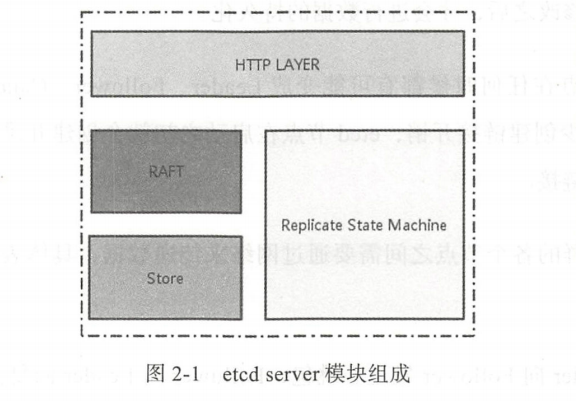

# 实战篇

## 1. 概述

**etcd 基于 Raft 协议**，通过复制日志文件的方式来保证数据的强一致性。

客户端应用写一个 key 时，首先会存储到 etcd Leader 上，然后再通过 Raft 协议复制到 etcd 集群的所有成员中，以此维护各成员（节点）状态的一致性与实现可靠性。

虽然 etcd 是一个强一致性的系统，但也支持从非 Leader 节点读取数据以提高性能，而且写操作仍然需要 Leader 支持，所以当发生网络分时，写操作仍可能失败。

**etcd 具有一定的容错能力**，假设集群中共有n个节点，即便集群中( n-1) /2个节点发生了故障，只要剩下的( n+1) /2 个节点达成一致， 也能操作成功,因此，它能够有效地应对网络分区和机器故障带来的数据丢失风险。

**etcd 默认数据一更新就落盘持久化，数据持久化存储使用 WAL (write ahead log） ，预写式日志。**格式 WAL 记录了数据变化的全过程，在 etcd 中所有数据在提交之前都要先写入 WAL 中； etcd Snapshot （快照）文件则存储了某一时刻 etcd 的所有数据，默认设置为每 10 000 条记录做一次快照，经过快照后WAL 文件即可删除。

## 2. 架构

### 1. 概述

etc 在设计的时候重点考虑了如下的四个要素：

#### 1. 简单

* 支持RESTful风格的HTTP+JSON的API
* v3版本增加了对gRPC的支持 同时也提供rest gateway进行转化
* Go语言编写，跨平台，部署和维护简单
* 使用Raft算法保证强一致性，Raft算法可理解性好

#### 2. 安全

支持TLS客户端安全认证

#### 3. 性能

单实例(V3)支持每秒10KQps

#### 4. 可靠

使用 Raft 算法充分保证了分布式系统数据的强一致性 etcd 集群是一个分布式系统，由多个节点相互通信构成整体的对外服务，每个节点都存储了完整的数据，并且通过 Raft 协议保证了每个节点维护的数据都是一致的。

etcd可以扮演两大角色：

* 持久化的键值存储系统
* 分布式系统数据一致性服务提供者

etcd(Server)大体上可以分为网络层(http(s) server)、Raft模块、复制状态机(RSM)和存储模块,具体如下：

* 网络层:提供网络数据读写功能，监听服务端口，完成集群节点之间数据通信，收发客户端数据。

* Raft模块：Raft强一致性算法的具体实现

* 存储模块：涉及KV存储、WAL文件、Snapshot管理等，用户处理etcd支持的各类功能的事务，包括数据索引 节点状态变更、监控与反馈、事件处理与执行 ，是 etcd 对用户提供的大多数 API 功能的具体实现

* 复制状态机：这是一个抽象的模块，状态机的数据维护在内存中，定期

  持久化到磁盘，每次写请求都会持久化到 WAL 文件，并根据写请求的

  内容修改状态机数据。

通常，一个用户的请求发送过来，会经由 HTTP ( S) Server 转发给存储模块进行具体的事务处理 如果涉及节点状态的更新，则交给 Raft 模块进行仲裁和日志的记录，然后再同步给别的 etcd 节点，只有当半数以上的节点确认了该节点状态的修改之后，才会进行数据的持久化。

etcd 集群的各个节点之间需要通过网络来传递数据，具体表现为如下几个方面：

* 1 ) Leader Follower 发送心跳包， Follower Leader 回复消息

* 2) Leader Follower 发送日志追加信息

* 3) Leader Follower 发送 Snapshot 数据

* 4 ) Candidate 节点发起选举，向其他节点发起投票请求

* 5) Follower 将收到的写操作转发给 Leader

### 2. etcd数据通道

在etcd 的实现中， etcd 根据不同的用途，定义了各种不同的消息类型些不同的消息，最终都将通过 protocol buffer 格式进行编码。

大消息如传输 Snapshot 的数据 就比较大，甚至会超过1GB ，而小消息则如 Leader Follower 节点之间的心跳消息可能只有几十 KB。

etcd 在实现中，对这些消息采取了分类处理的方式，它抽象出了两种类型的消息传输通道，即 Stream类型通道和 Pipeline 类型通道。

* Stream: 用于处理数据量较少的消息,例如心跳、日志追加消息等。点到点之间维护一个HTTP长连接。
* Pipeline:用于处理数据量大的消息，如Snapshot。不维护长连接。

> Snapshot这种数据量大的消息必须和心跳分开传，否则会阻塞心跳消息。
>
> Pipeline也能用于传小消息前提是Stream不能用了。

### 3. etcd架构

**1. 网络层与Raft模块交互**

etcd 通过 Raft 模块中抽象的 RaftNode 拥有一个消息盒子，RaftNode 将各种类型的消息都放入消息盒子中，由专门的 go routine 将消息盒子里的消息写人管道（Go 语言的 Channel ），而管道的另外一端就链接在网络层的不同类型的传输通道上，同样，也有专门的 go routine 在等待（ select ）消息的到达。

> 网络层与Raft模块之间通过Go语言的Channel来完成数据通信。

**2.Server与Client交互**

etcd server 在启动之初 ，会监听服务端口，待服务端口收到客户端的请求之后，就会解析出消息体，然后通过管道传给 Raft 模块，当 Raft 模块按照Raft 协议完成操作时，会回复该请求(或者请求超时关闭了)。

**3.Server之间的交互**

etcd server 之间通过 peer 端口(初始化时可以手动指定)使用 HTTP 进行通信 etcd server peer口主要用来协调 Raft 的相关消息，包括各种提议的协商。

## 3. 应用场景

### 1. 服务注册与发现
go-micro默认注册中心现在也换成了etcd。
问题：为什么不用redis做服务注册与发现？

> https://www.v2ex.com/t/440220 

### 2. 配置中心

应用在启动的时候主动从 获取一次配置信息，同时，在 etcd节点上注册 Watcher 并等待，以后每当配置有更新的候， etcd 都会实时通知订阅者，以 达到获取最新配置信息的目的。

### 3. 分布式通知与协调

和配置中心差不多，不同的系统都在 etcd 上对同一个目录进行注。同时设

Watcher 监控该目录的变化（如子目录的变化也有需求， 那么可以设置成递归模式） 若某个系统更新了 etcd 的目录，那么设置了 Watcher 的系统就会收到通知，并做出相应的通知，然后进行相应的处理。

### 4. 分布式锁

因为 etcd 使用 Raft 算法保持了数据的强一致性，某次操作存储集群中的值就必然是全局一致的，所以 etcd 容易实现分布式锁。

## 4. 对比

Consul 的优势在于服务发现， etcd 的优势在于配置信息共享和方便运维，

Zoo Keeper 的优势在于稳定性 因为设计思路的不同，因此在原生接口和提供服务方式方面， etcd 更适合作为集群配置服务器，用来存储集群中的大关键数据。它所具有的 REST 接口也可以让集群中的任意 个节点在使用 key value务时获取方便