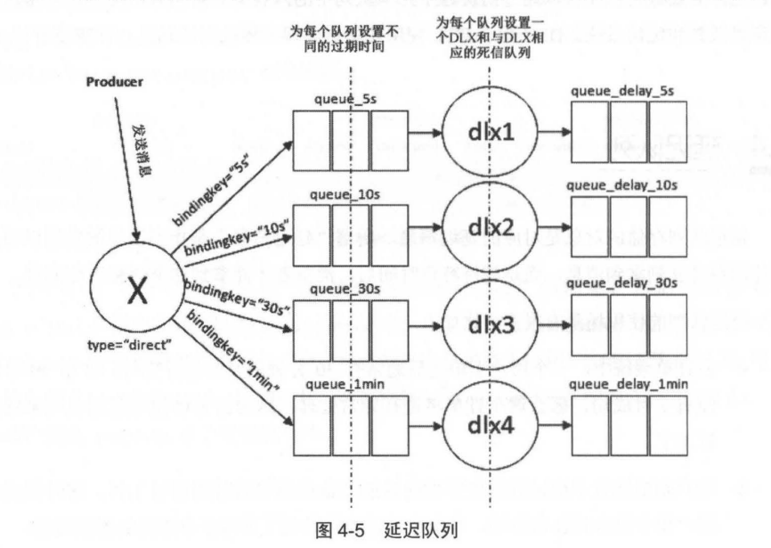

# RabbitMQ进阶

## 1. 消息何去何从

### 1. mandatory参数

为true时 如果交换器无法根据自身类型和路由键找到一个符合条件的队列 那么会将消息返回给生产者 为false则会丢弃消息。

### 2. immediate参数

为true时 交换器在路由时发现该队列上没有任何消费者，那么将不会把消息存入对列,如果符合条件的队列都没有消费者那么会把消息返回给生产者。

**RabbitMQ3.0之后已取消该参数 所以如果客户端还有该参数的话必须设置为false**

否则会出现如下错误

> ```sh
> operation basic.publish caused a connection exception not_implemented: "immediate=true"
> ```

### 3. 备份交换器

未指定`mandatory`时消息可能会丢失，指定`mandatory`参数为true后需要添加ReturnListener又会增加生产者代码复杂度。所以可以添加一个备份交换器来收集这些消息。


>  消息被发送到备份交换机的路由键与生产者发出的路由键是一样的， 因此备份交换机的类型一般设置为fanout类型 

```go
	// 定义为备份交换器 参数alternate-exchange
	args := amqp.Table{"alternate-exchange": ExChangeBack}
	err = ch.ExchangeDeclare(ExChangeBack, amqp.ExchangeFanout, false, true, false, false, args)
```

测试的时候好像并没有发过去emmm


## 2. 过期时间(TTL)

RabbitMQ可以对消息和队列设置TTL. 目前有两种方法可以设置。第一种方法是通过`队列属性`设置，队列中所有消息都有相同的过期时间。第二种方法是对`消息进行单独设置`，每条消息TTL可以不同。如果上述两种方法同时使用，则消息的过期时间以两者之间TTL较小的那个数值为准。消息在队列的生存时间一旦超过设置的TTL值，就称为dead message， 消费者将无法再收到该消息。
**如果设置了队列的TTL属性，那么一旦消息过期，就会被队列丢弃，**

**而第二种方式，消息即使过期，也不一定会被马上丢弃**，因为消息是否过期是在即将投递到消费者之前判定的，如果当前队列有严重的`消息积压`情况，则已过期的消息也许还能存活较长时间。

```go
	// x-expires 设置队列有效期 过期后将删除队列(但不保证能及时删除)
	// x-message-ttl 给进入队列的消息设置有效期
	var args = make(amqp.Table, 0)
	args["x-expires"] = 1800000
	args["x-message-ttl"] = 6000
	q, err := ch.QueueDeclare(Queue, false, false, false, false, args)
```


## 3. 死信队列

### 1. 概述

DLX(Deat0Letter-Exchange)死信交换器，当消息变成死信之后会被重新发送到另一个交换器中即DLX，绑定DLX的队列就称为死信队列。

> 死信队列是一个正常的交换器和一般交换器没有区别，只是在定义队列的时候指定某些参数

消息变成死信一般由于以下几种情况:

* 1.消息被拒绝Reject或Nack且设置requeue为false
* 2.消息过期
* 3.队列达到最大长度(队列满了，无法再添加数据到mq中)

**死信队列和死信交换器都只是一个名称，和普通队列普通交换器一样的，并没有别的作用**

### 2. 具体流程

定义两个交换器，一个用于业务一个做死信交换器(**两个都是普通交换器**)。

定义一个正常业务队列,定义的时候需要指定一个交换器作为该队列的死信交换器，同时还还可以指定死信消息重新发到死信交换器后需不需要改变routingKey之类的。

然后在定义一个普通队列做为死信队列，绑定到死信交换器上。

> 推荐是同一个应用中死信交换器可以共用一个，但是死信队列最好还是分开，否则区分不了消息。

```go
	// 定义交换器 一个用作业务交换器 一个用作死信交换器
	err := ch.ExchangeDeclare(ExChange, amqp.ExchangeTopic, false, true, false, false, nil)
	err = ch.ExchangeDeclare(ExChangeDLX, amqp.ExchangeFanout, false, true, false, false, nil)

	// 死信队列
	qDxl, err := ch.QueueDeclare(QueueDLX, false, true, false, false, nil)
	if err != nil {
		panic(err)
	}
	// 声明队列 一个用作业务队列 一个用作死信队列
	
	// 定义正常队列的时候指定一个死信交换器
	var args = make(amqp.Table)
	args["x-message-ttl"] = 1000 // 延迟1秒
	// x-dead-letter-exchange 指定queue的死信队列为`ExChangeDLX`
	args["x-dead-letter-exchange"] = ExChangeDLX
	// x-dead-letter-routing-key 指定死信消息的新路由键 未指定则使用消息原来的路由键
	args["x-dead-letter-routing-key"] = RoutingKeyDLX
	// 声明队列 一个用作业务一个用作死信
	qNormal, err := ch.QueueDeclare(Queue, false, true, false, false, args)
	if err != nil {
		panic(err)
	}

	// 将队列绑定到交换器上
	err = ch.QueueBind(qNormal.Name, RoutingKey, ExChange, false, nil)
	err = ch.QueueBind(qDxl.Name, RoutingKeyDLX, ExChangeDLX, false, nil)
```


## 4. 延迟队列

### 1. 概述

延迟队列存储的对象肯定是对应的延迟消息，所谓”延迟消息”是指当消息被发送以后，并不想让消费者立即拿到消息，而是等待指定时间后，消费者才拿到这个消息进行消费。

> 比如在订单系统中，一个用户下单之后通常有30分钟的时间进行支付，如果30分钟之内没有支付成功，那么这个订单将进行处理。这是就可以使用延迟队列将订单信息发送到延迟队列。


RabbitMQ中的实现如下




在定义queue的时候可以通过`x-message-ttl`参数指定进入该队列的消息设置有TTL。

同时在对这个queue添加一个死信交换器和死信队列。这样ttl到了消息就会进入对应的死信队列。

最后消费者订阅死信队列即可达到延迟队列的效果。

> 生产者将消息发到queue-5s 该queue会给所有入队消息知道ttl=5s 然后5s后消息过期成为死信 被重新发送到事先指定的死信交换器 然后再路由到死信队列queue-5s-dlx 
>
> 消费者直接订阅queue-5s-dlx队列 这样每次获取到消息都要等消息先过期，即延迟。

### 2. 问题

**RabbitMQ只会检查第一个消息是否过期，如果过期则丢到死信队列,如果有延时较长的消息则会阻塞后续消息**

>  假设第一个消息过期时间10s,第二个是5s，那么RabbitMQ会等10s后发现第一个消息过期了，然后丢到死信交换器。接着才能发现第二个消息也过期了。

**解决方法**

**根据延迟等级(5s 10s 30s 1min 10min这种)定义多个死信队列**。发送消息的时候根据延迟等级是的RoutingKey，然后路由到对应的队列，不过这样会比较复杂。

RabbitMQ社区提供了一个插件`rabbitmq_delayed_message_exchange`可以用于解决该问题。

下载插件(注意插件版本和RabbitMQ版本问题)，然后解压放置到RabbitMQ的插件目录。

```sh
github https://github.com/rabbitmq/rabbitmq-delayed-message-exchange

rabbitmq插件集合 https://www.rabbitmq.com/community-plugins.html
```

接下来，进入RabbitMQ的安装目录下的sbin目录，执行下面命令让该插件生效，然后重启RabbitMQ。

```sh
rabbitmq-plugins enable rabbitmq_delayed_message_exchange
```

### 3. 讨论

看起来延迟队列干的事情似乎使用定时任务也能处理，一直轮询数据，每秒查一次，取出需要被处理的数据，然后处理不就完事了吗？

对庞大的数据量仍旧使用轮询的方式显然是不可取的，很可能在一秒内无法完成所有数据的检查，同时会给数据库带来很大压力，无法满足业务要求而且性能低下。

更重要的一点是，不！优！雅！

没错，作为一名有追求的程序员，始终应该追求更优雅的架构和更优雅的代码风格，写代码要像写诗一样优美

## 5. 优先级队列

优先级队列，顾名思义，具有更高优先级的队列具有较高的优先权，优先级高的消息具备优先被消费的特权。
定义队列时可以通过`x-max-priority`参数指定队列最高优先级。

发送消息时可以通过`Priority`指定优先级，最大不超过队列的最高优先级。

```go
	// 声明队列  
	var args = make(amqp.Table, 0)
	// x-max-priority 指定队列最大优先级
	args["x-max-priority"] = 5
	qNormal, err := ch.QueueDeclare(QueueDLX, false, false, false, false, args)
	if err != nil {
		panic(err)
	}
		// 发送消息时指定消息优先级Priority
		body := "Hello World33!"
		err = ch.Publish(ExChange, RoutingKey, false, false, amqp.Publishing{
			DeliveryMode: amqp.Persistent,
			ContentType:  "text/plain",
			Timestamp:    time.Now(),
			Body:         []byte(body),
			Priority:     1,
		})
```


## 6. 持久化

消息的可靠性是RabbitMQ的一大特色，那么RabbitMQ是如何保证消息可靠性的呢——消息持久化。
为了保证RabbitMQ在退出或者crash等异常情况下数据没有丢失，需要将queue，exchange和Message都持久化。


```go
/*
交换器、队列、消息都需要持久化
交换器、队列定义是durable参数为true即可持久化
消息定义时DeliveryMode: amqp.Persistent即为持久化
*/
```


### 1. 交换器

交换器持久化通过定义交换器时指定durable参数为true实现的。

交换器未持久化则RabbitMQ重启后会丢失交换器元数据，但是消息不会丢。

只是不能再将消息发到这个交换器了(交换器都不在了)，对于长期使用的交换器建议持久化。


### 2. 队列

队列持久化通过定义队列时指定durable参数为true实现的。

队列未持久化则RabbitMQ重启后会丢失队列元数据，同时消息也会丢。因为消息是存在队列中的，队列都不在了消息自然也没地方保存了。

队列持久化后也只能保证自己元数据不丢并不能保证消息不丢，但是不设置持久化消息肯定会丢。


### 3. 消息

需要保证消息不丢要在发送消息的时候指定消息持久化。


### 4. 小结

为了保证消息不丢，需要将队列和消息都设置为持久化，同时会长期使用的交换器也建议设置为持久化。

可以将所有消息都设置为`持久化`但是这样`会严重影响RabbitMQ的性能`，毕竟写入磁盘肯定比写入内存慢很多很多。

所以是否需要持久化需要在可靠性和吞吐量之间做一个权衡。

### 5. 进一步讨论

**1.持久化之后就能保证100%保证数据不丢失了吗？**

**1.consumer autoAck问题**

从consumer端来说，如果这时autoAck=true，那么当consumer接收到相关消息之后，还没来得及处理就crash掉了，那么这样也算数据丢失，这种情况也好处理，只需将autoAck设置为false。

**2.数据落盘延迟**

**消息在正确存入RabbitMQ之后，还需要有一段时间（这个时间很短，但不可忽视）才能存入磁盘之中**，RabbitMQ并不是为每条消息都做fsync的处理，可能仅仅保存到cache中而不是物理磁盘上，在这段时间内RabbitMQ broker发生crash, 消息保存到cache但是还没来得及落盘，那么这些消息将会丢失。

首先可以引入RabbitMQ的`mirrored-queue`即`镜像队列`，这个相当于配置了副本，当master在此特殊时间内crash掉，可以自动切换到slave，这样有效的保障了HA, 除非整个集群都挂掉，这样也不能完全的100%保障RabbitMQ不丢消息，但比没有mirrored-queue的要好很多
还有要在producer引入`事务机制`或者`Confirm机制`来确保消息已经正确的发送至broker端


**2.消息什么时候刷到磁盘？**

写入文件前会有一个Buffer,大小为1M,数据在写入文件时，首先会写入到这个Buffer。

* 1.如果Buffer已满，则会将Buffer写入到文件（未必刷到磁盘）。
* 2.有个固定的刷盘时间：25ms,也就是不管Buffer满不满，每个25ms，Buffer里的数据及未刷新到磁盘的文件内容必定会刷到磁盘。
* 3.每次消息写入后，如果没有后续写入请求，则会直接将已写入的消息刷到磁盘


## 7. 生产者确认

当消息的发布者在将消息发送出去之后，消息到底有没有正确到达broker代理服务器呢？ 

RabbitMQ为我们提供了两种方式：

1. 通过AMQP事务机制实现，这也是AMQP协议层面提供的解决方案；
2. 通过将channel设置成confirm模式来实现；


### 1. 事务机制

RabbitMQ中与事务机制有关的方法有三个：

* `txSelect`：用于将当前channel设置成transaction模式，

* `txCommit`：用于提交事务，

* `txRollback`：用于回滚事务，

在通过txSelect开启事务之后，我们便可以发布消息给broker代理服务器了，如果txCommit提交成功了，则消息一定到达了broker了，如果在txCommit执行之前broker异常崩溃或者由于其他原因抛出异常，这个时候我们便可以捕获异常通过txRollback回滚事务了。
开启事务后比正常发送流程多了4个步骤:

- client发送Tx.Select
- broker发送Tx.Select-Ok(之后publish)
- client发送Tx.Commit
- broker发送Tx.Commit-Ok

 但是使用事务机制的话会降低RabbitMQ的性能 。

```go
func publish(ch *amqp.Channel) {
	err := ch.Tx()
	if err != nil {
		logrus.Error("事务开启失败:", err)
	}
	body := "Hello World33!"
	err = ch.Publish(ExChange, RoutingKey, false, false, amqp.Publishing{
		DeliveryMode: amqp.Persistent,
		ContentType:  "text/plain",
		UserId:       "guest",
		AppId:        "go",
		Timestamp:    time.Now(),
		Body:         []byte(body),
	})
	if err != nil {
		fmt.Println("send error: ", err)
		err := ch.TxRollback()
		if err != nil {
			logrus.Error("事务回滚失败:", err)
		}
	} else {
		err := ch.TxCommit()
		if err != nil {
			logrus.Error("事务提交失败:", err)
		}
	}
}

```


### 2. 发送方确认机制(Confirm模式）

Confirm模式是比事务更高效的解决方案。

生产者将信道设置成confirm模式，**一旦信道进入confirm模式，所有在该信道上面发布的消息都会被指派一个唯一的ID(从1开始)，一旦消息被投递到所有匹配的队列之后，broker就会发送一个确认给生产者（包含消息的唯一ID）**,这就使得生产者知道消息已经正确到达目的队列了。

如果消息和队列是可持久化的，那么确认消息会将消息写入磁盘之后发出。

broker回传给生产者的确认消息中deliver-tag域包含了确认消息的序列号，此外broker也可以设置basic.ack的multiple域，表示到这个序列号之前的所有消息都已经得到了处理。

客户端实现生产者confirm有三种编程方式：

* 普通confirm模式：每发送一条消息后，调用waitForConfirms()方法，等待服务器端confirm。实际上是一种串行confirm了。
* 批量confirm模式：每发送一批消息后，调用waitForConfirms()方法，等待服务器端confirm。
* 异步confirm模式：提供一个回调方法，服务端confirm了一条或者多条消息后Client端会回调这个方法。
  

```go
/*
对于消息的确认机制略有些蛋疼。因为在发送的时候不可配置发送的消息id，但在接收确认时，消息id是按照自然数递增的，
也就是说发送者需要按照自然数递增的顺序自己维护发送的消息id。
*/
func publish(ch *amqp.Channel, deliveryMap map[uint64]*amqp.Publishing, deliveryTag, ackTag *uint64) {
	// 发送消息
	// 切换到confirm模式
	err := ch.Confirm(false)
	if err != nil {
		logrus.Error("切换到confirm模式失败:", err)
	}
	for i := 0; i < 9999; i++ {
		body := "Hello World33!"
		err = doPublish([]byte(body), deliveryMap, deliveryTag)
	}
	// 调用NotifyPublish 存储确认结果
	notifyChan := make(chan amqp.Confirmation)
	ch.NotifyPublish(notifyChan)
	for v := range notifyChan {
		fmt.Printf("DeliveryTag:%v Ack%v \n", v.DeliveryTag, v.Ack)
		if v.Ack {
			// ack后就从map里删除
			*ackTag++
			delete(deliveryMap, v.DeliveryTag)
		} else {
			// 	未Ack则可以考虑重发等操作
			err = doPublish(deliveryMap[v.DeliveryTag].Body, deliveryMap, deliveryTag)
		}
	}
}

// doPublish 发送消息
func doPublish(body []byte, deliveryMap map[uint64]*amqp.Publishing, deliveryTag *uint64) error {
	msg := amqp.Publishing{
		DeliveryMode: amqp.Persistent,
		ContentType:  "text/plain",
		UserId:       "guest",
		AppId:        "go",
		Timestamp:    time.Now(),
		Body:         body,
	}
	deliveryMap[*deliveryTag] = &msg
	err := ch.Publish(ExChange, RoutingKey, false, false, msg)
	if err != nil {
		fmt.Println("send error: ", err)
	} else {
		// 确认结果中DeliveryTag是递增的 但是发送的时候获取不到这个值 只能自己维护。。
		*deliveryTag++
	}
	return err
}

```


## 8. 消费端要点

### 1. 消息分发

当RabbitMQ队列拥有多个消费者时，队列收到的消息将以轮询的方式分发给消费者。每条消息只会发送给订阅列表里的一个消费者。

这样RabbitMQ会平均地把消息发给所有的消费者，但是如果有的消费者消费快(逻辑简单或者机器性能好)，有的消费慢(业务逻辑复杂或机器性能差)这样就会造成资源的浪费。

于是RabbitMQ提供了**prefetchCount**参数用于限制信道上的消费者所能保持的最大未确认消息的数量,**prefetchSize**参数则用于显示最大未确认消息的大小(单位为Byte字节)。

假设消费端指定`prefetchCount`为5，然后订阅了某个队列开始消费，RabbitMQ会有对应的消费者计数，当达到了上限之后就不会再向这个消费者发送消息了，等消费者确认某条消息后这个计数就会减1，然后就可以继续接收消息。

类似于TCP/IP中的`滑动窗口`，不过这个对拉模式的消费方式是无效的。

但是这样由于RabbitMQ需要去协调各个队列确保没有超过这个上限所以会降低性能。为了提升相关的性能又增加了**golbal**参数，即是否全局使用`prefetchCount`参数。

为false的时候只有新加入的消费者才需要准从，为true则都要遵从，这样确实可以提高一定的性能。

```go
	// 为确认最大10条消息 最大100字节 不开全局
	ch.Qos(10, 100, false)
```


### 2. 消息顺序性

RabbitMQ只有在不使用任何高级特性，也没有任何消息丢失网络故障之类的异常情况下，而且只有一个消费者最好也只有一个生产者的情况下能保证消息的顺序性。

**回滚**

开启事务之后异常则回滚那消息顺序肯定被打乱。

**Nack/Reject**

处理消息的时候Nack或者Reject然后再次入队也会打乱消息顺序。

> 想要保证消息顺序性需要在业务逻辑中做进一步处理，比如在消息中添加一个全局有序标识。

### 3. 弃用QueueingConsumer

* 1.automatic connection recovery不支持QueueingConsumer的这种形式；
* 2.存在内存溢出问题。 


## 9. 消息传输保障

消息传输可靠性一般是接入消息中间件的时候首要考虑的问题，一般消息中间件的消息传输保障分为三个层级：

* At most once:最多一次，消息可能会丢，但绝不会重复传输
* Al least once:最少一次，消息绝不会丢失，但可能会重复传输
* Exactly once:恰好一次，每天消息肯定会被传输且仅传输一次。


RabbitMQ支持其中的`最多一次`和`最少一次`。

其中`最少一次`投递实现需要考虑一下几个方面:

* 1.生产者需要开启事务或confirm机制，确保消息能可靠地传输到RabbitMQ中。
* 2.生产者需要使用`mandatory`参数或备份交换器确保消息能够从交换器路由到队列中，进而能够报错下了而不会被丢弃。
* 3.消息和队列都需要持久化，以确保RabbitMQ异常时不会丢消息。
* 4.消费者需要将autoAck设置为false，手动确认。

`最多一次`的方式就不用管这么多，生产者随意发，消费者随意消费，不过这样很难保证消息不丢。

`恰好一次`这个RabbitMQ无法保证，主要是会出现重复消息。

比如消费者消费完消息后发生Ack时网络断开或其他原因导致RabbitMQ没收到Ack那么这条消息就不会被删除，从而造成重复消息。

或者开启confirm机制生产者由于网络问题没有收到RabbitMQ的确认消息以为消息没有发到MQ又会从发一次还是会造成消息重复。


目前大多数主流的消息中间件都没有`去重机制`，主要还是开业务客户端实现，比如引入GUID(Globally Unique Identifier)的概念。


## 10. 小结

提升数据可靠性途径:

* 1.生产者设置事务或publisher confirm机制 保证消息能发到MQ

* 2.生产者设置mandatory参数或备份交换机 保证消息发到Exchange后不会因为没有消费者或队列就被丢弃掉
* 3.设置交换器、队列、消息都为持久化 确保消息不会因为MQ服务器异常而丢失
* 4.镜像队列 确保消息不会因为MQ服务器异常而丢失
* 5.消费者手动Ack 确保消息真的消费了才会从MQ服务器删除。

