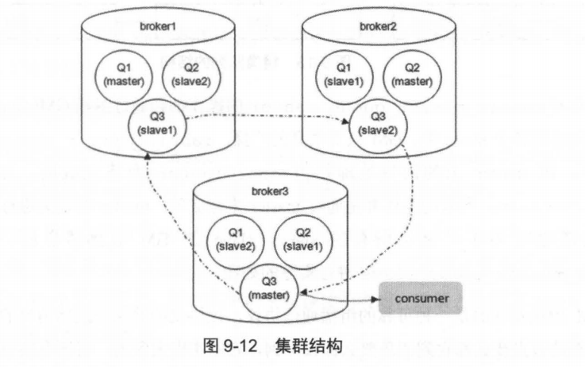

# RabbitMQ高阶

## 1. 存储机制

不管是持久化还是非持久化的消息都有可能被写入到磁盘。持久化消息在到达队列时就被写入磁盘，如果内存充足的话也会在内存中保存一份以提高性能，直到内存不足时会自动移除。
非持久化的消息一般只保存在内存中，但是内存不足时也会被写入到磁盘以节省内存空间。

具体落盘处理都在RabbitMQ的`持久层`中完成。

持久层是一个逻辑上的概念，实际包含两个部分：`队列索引(rabbit_queue_index)`和`消息存储(rabbit_msg_store)`。

`队列索引(rabbit_queue_index)`负责维护队列中落盘消息的信息，包括消息的存储地点、

是否已被交付给消费者、是否已被消费者ack等。

`消息存储(rabbit_msg_store)`则以键值对的形式存储消息,具体还可以分为`msg_store_persistent`负责持久化消息的持久化，重启后消息不会丢失和`msg_store_transient`负责非持久化消息的持久化，重启后消息会丢失。


消息可以直接存储在`队列索引(rabbit_queue_index)`中，也可以存储在`消息存储(rabbit_msg_store)`中。默认在`$RABBITMQ_HOME/var/lib/mnesia/rabbit@$HOSTNAME`路径下包含`queues`、`msg_store_persistent`和`msg_store_transient`三个文件夹。

最佳情况是较小的消息存在`队列索引(rabbit_queue_index)`中，较大的存在`消息存储(rabbit_msg_store)`中。具体是以4096Bytes限制的，可以通过`queue_index_embed_msgs_below`来配置。


### 1. 队列的结构

通常队列由`rabbit_amqpqueue_process`和`backing_queue`这两部分组成。

`rabbit_amqpqueue_process`：负责协议相关的消息处理，即接收生产者发布的消息、向消费者交付消息、处理消息的确认等。
`backing_queue`：是消息存储的具体形式和引擎，并向`rabbit_amqpqueue_process`提供相关接口以供调用。

如果消息发送的队列是空的且队列有消费者，该消息不会经过该队列直接发往消费者，如果无法直接被消费，则需要将消息暂存入队列，以便重新投递。消息在存入队列后，主要有以下几种状态：

* `alpha`：消息内容(包括消息体、属性和headers)和消息索引都存在内存中
* `beta`：消息内容保存在磁盘中，消息索引都存在内存中
* `gamma`：消息内容保存在磁盘中，消息索引在磁盘和内存中都存在
* `delta`：消息内容和消息索引都在磁盘中


于没有设置优先级和镜像的队列来说，`backing_queue`的默认实现是`rabbit_variable_queue`，其内部通过`5`个子队列来体现消息的各个状态：

- Q1：只包含alpha状态的消息
- Q2：包含beta和gamma的消息
- Delta：包含delta的消息
- Q3：包含beta和gamma的消息
- Q4：只包含alpha状态的消息

消息的状态一般变更方向是`Q1->Q2->Delta->Q3->Q4`，大体是从内存到磁盘然后再到内存中。

> 即在队列负载高的情况下保存一部分消息到磁盘以节约内存，负载低时在从磁盘读取到内存，使得队列具有一定弹性。


### 2. 惰性队列

**惰性队列会尽可能的将消息存入磁盘中，而在消费者消费到相应的消息时才会被加载到内存中**，它的一个重要的设计目标是能够支持更长的队列，即支持更多的消息存储。当消费者由于各种各样的原因（比如消费者下线、宕机亦或者是由于维护而关闭等）而致使长时间内不能消费消息造成堆积时，惰性队列就很有必要了。

> 用时间换空间 存入磁盘后牺牲获取时的效率(需要I/O操作)来换取了更大的空间(磁盘肯定比内存大)。

默认情况下队列中的消息会尽可能的存储在内存之中，以保证能快速的将消息发送给消费者。

惰性队列会将接收到的消息直接存入文件系统中，而不管是持久化的或者是非持久化的，这样可以减少了内存的消耗，但是会增加I/O的使用。

> 如果消息是持久化的，那么这样的I/O操作不可避免，惰性队列和持久化消息可谓是“最佳拍档”。

**注意**如果惰性队列中存储的是非持久化的消息，内存的使用率会一直很稳定，但是重启之后消息一样会丢失。

队列具备两种模式：`default`和`lazy`,默认的为`default`模式，`lazy`模式即为惰性队列的模式。

可以通过调用`channel.queueDeclare`方法的时候在参数中设置;也可以通过`Policy`的方式设置;

如果一个队列同时使用这两种方式设置的话，那么Policy的方式具备更高的优先级。

如果要通过声明的方式改变已有队列的模式的话，那么只能先删除队列，然后再重新声明一个新的

**queueDeclare方式**

```go
	// 声明队列
	// 惰性队列需要增加参数
	var args = make(amqp.Table)
	// queue-mode=lazy 指定queue为惰性队列
	args["queue-mode"] = "lazy"
	qLazy, err := ch.QueueDeclare(QueueDLX, false, false, false, false, args)
	if err != nil {
		panic(err)
	}
```

**policy方式**

```sh
rabbitmqctl set_policy Lazy "^myqueue$" '{"queue-mode":"lazy"}' --apply-to queues
```


惰性队列和普通队列相比，只有很小的内存开销。这里很难对每种情况给出一个具体的数值，但是我们可以类比一下：当发送1千万条消息，每条消息的大小为1KB，并且此时没有任何的消费者。

那么普通队列会消耗1.2GB的内存，而惰性队列只消耗1.5MB的内存。


**小结**

* 惰性队列的存在是为了减少内存占用，避免由于内存不足而产生的换页操作。

* 但对比惰性队列和普通队列，如果在内存和磁盘均不设限制的话，采用普通队列的效率会更高(毕竟磁盘再快，对比内存也会差一个数量级)。


**一般推荐惰性队列+持久化消息搭配使用**

> 因为持久化消息本来就要写入磁盘


## 2. 内存及磁盘告警

当内存使用超过配置的阈值或磁盘剩余空间低于配置的阈值时，RabbitMQ都会**暂时阻塞客户端连接**并停止接收客户端发来的消息，以此避免服务崩溃。


被阻塞的连接会有两种状态：

* 如果不试图发消息的连接就是`blocking`状态,可以继续运行(即**消费者不受影响**)
* 如果试图发消息则会进入`blocked`状态(即**生产者会被停止发送消息**)


**集群中一个Broker节点内存或磁盘受限将引起集群中所有Connection被阻塞。**


### 1. 内存告警

RabbitMQ 服务器会在启动或者执行`rabbitmqctl set_vm_memory_high_watermark <fraction> `的时候计算系统的内存大小,默认情况下这个值为`0.4`，表示当 RabbitMQ 使用的内存超过40%时,就会产生内存告警并阻塞`所有生产者连接`,一旦告警被解除,一切恢复正常.

最坏的情况下, erlang 垃圾回收会导致`两倍`的内存消耗,也就是80%的占比.

> 设置为0时所有生产者都会被停止发送消息

**建议取值在0.4~0.66 不建议超过0.7**


**内存换页**

当 Broker 节点触及内存并阻塞生产者之前,它会尝试**将队列中的消息换页到磁盘以释放内存空间**,默认情况下,当内存达到`内存阈值的50%`的时候回触发换页动作。

> 如果内存阈值为0.4,就是说当内存使用超过 0.4 * 0.5 的时候会进行换页动作

可以通过配置项`vm_memory_watermark_paging_ratio` 来修改此配置,此配置项只能通过配置文件修改。


### 2. 磁盘告警

当剩余磁盘空间低于确定阈值时, RabbitMQ 同样会阻塞生产者。这样可以避免因为非持久化的消息持续换页而耗尽内存导致服务崩溃。

默认情况磁盘阈值为`50MB`, 即当磁盘剩余空间小于50MB时会阻塞生产者并停止内存中的消息换页动作。

这个阈值可以减小但并不能完全消除因磁盘耗尽而导致崩溃的可能性,比如在两次磁盘空间检测期间,磁盘剩余空间从50MB 降低到0MB。

**相对谨慎的做法是设置为和内存大小一致**

> 这样就算把内存中所有数据全写入磁盘也不会出现问题。


同样可以通过配置文件修改

```sh
[
    {
        rabbit,[
            {
            	#固定值2G
                disk_free_limit, "2G"
            }
        ]
    }
]

[
    {
        rabbit,[
            {
                disk_free_limit, {
                # 或者参考系统内存大小,设置一个动态值
                # 建议mem_relative取值为1.0~2.0
                    mem_relative, 1.0
                }
            }
        ]
    }
]
```


## 3. 流控

RabbitMQ还引入了`流控(Flow Control)`机制来确保稳定性。主要用于避免消息发送太快而导致服务器难以支撑的情形。


内存和磁盘告警相当于是一个全局流控，会阻塞所有Connection，而Flow Control则是针对单个Connection的。


RabbitMQ流控机制的核心是一个称为`{InitialCredit, MoreCreditAfter}的`元组，默认情况下值为{200, 50}。

假如消息发送者A要给接收者B发消息:

**每发一条消息，Credit数量减1，直到为0，A被block住，对于接收者B，每接收MoreCreditAfter条消息，会向A发送一条消息，给予A MoreCreditAfter个Credit，当A的`Credit>0`时，A可以继续向B发送消息**。

> 即A一开始可以发200条，然后等B确认50条之后才能继续发送。


**流控机制不只是作用于Connection，同样作用于Channel，再到队列，最后是消息持久化存储形成一个完整的流控链**。

可以借此机制找出RabbitMQ队列中的瓶颈所在。

```sh
Connection-->Channel-->Queue-->Store
```

如果`Connection`处于Flow状态，说明后续的`Channel`、`Queue`、`Store`中一个或多个存在瓶颈。

如果`Channel`处于Flow状态，说明后续的`Queue、Store`存在瓶颈。

如果`Queue`处于Flow状态，说明后续的`Store`存在瓶颈。


## 4. 镜像队列

### 1. 概述

如果RabbitMQ集群中有多个Broker节点，虽然该集群对于单点故障是有弹性的，但是对于其中的某一个节点如果挂掉了则该节点对应的队列不可用。


引入镜像队列(Mirror Queue)的机制,可以将队列镜像到集群中其他Broker节点上，如果节点失效了，队列能自动切换到镜像中的另一个节点上以保证服务的可用性。


在通常的用法中，针对每一个配置镜像的队列都包含一个master和多个slave，分别对应于不同的节点。

slave会准确地按照master执行命令的顺序进行命令执行，故slave与master上维护的状态应该是相同的。

**除了publish外所有动作(命令)都只会向master发送，然后由master将命令执行的结果广播给slave们**，故看似从镜像队列中的消费操作实际上是在master上执行的。

> 如果消费者与slave建立连接并进行订阅消费，其实质上都是从master上获取消息，只不过看似是从slave上消费而已。


> 简单来说，镜像队列机制就是将队列在三个节点之间设置主从关系，消息会在三个节点之间进行自动同步，且如果其中一个节点不可用，并不会导致消息丢失或服务不可用的情况，提升MQ集群的整体高可用性。





### 2. 设置镜像队列

```sh
rabbitmqctl set_policy [-p Vhost] Name Pattern Definition [Priority]
```

* `-p Vhost`： 可选参数，针对指定vhost下的queue进行设置

* `Name`: policy的名称

* `Pattern`: queue的匹配模式(正则表达式)

* `Definition`：镜像定义，包括三个部分ha-mode, ha-params, ha-sync-mode
* ` ha-mode`:指明镜像队列的模式，有效值为 all/exactly/nodes
  * `all`：表示在集群中所有的节点上进行镜像
  *  `exactly`：表示在指定个数的节点上进行镜像，节点的个数由ha-params指定
  * `nodes`：表示在指定的节点上进行镜像，节点名称通过ha-params指定
  * `ha-params`：ha-mode模式需要用到的参数

* ha-sync-mode：进行队列中消息的同步方式，有效值为automatic和manual

* `priority`：可选参数，policy的优先级

### 3. 镜像队列消息的同步

将新节点加入已存在的镜像队列时，默认情况下`ha-sync-mode=manual`，镜像队列中的消息`不会主动同步`到新节点，除非显式调用同步命令。

当调用同步命令后，队列开始阻塞，无法对其进行操作，直到同步完毕。当ha-sync-mode=automatic时，新加入节点时会默认同步已知的镜像队列。**由于同步过程的限制，所以不建议在生产的active队列（有生产消费消息）中操作。**

`rabbitmqctl list_queues name slave_pids synchronised_slave_pids ` 查看那些slaves已经完成同步

`rabbitmqctl sync_queue name`  手动的方式同步一个queue

`rabbitmqctl cancel_sync_queue name` 取消某个queue的同步功能

以上针对消息同步的命令，均可以通过监控界面来进行操作，最终也是通过这些操作命令执行。


### 4. 故障处理

**RabbitMQ集群节点失效，MQ处理策略**：

如果某个`slave失效`了，系统处理做些记录外几乎啥都不做：master依旧是master，客户端不需要采取任何行动，或者被通知slave失效。

如果`master失效`了，那么slave中的一个必须被选中为master。

**被选中作为新的master的slave通常是最老的那个**，因为最老的slave与前任master之间的同步状态应该是最好的。然而，特殊情况下，**如果存在没有任何一个slave与master完全同步的情况，那么前任master中未被同步的消息将会丢失。**

**镜像队列中某个节点宕掉的后果：**

 当slave宕掉了，除了与slave相连的客户端连接全部断开之外，没有其他影响。

  当master宕掉时，会有以下连锁反应：

* 1. 与master相连的客户端连接全部断开；

* 2.选举最老的slave节点为master。若此时所有slave处于未同步状态，则未同步部分消息丢失；

* 3.新的master节点requeue所有unack消息，因为这个新节点无法区分这些unack消息是否已经到达客户端，亦或是ack消息丢失在老的master的链路上，亦或者是丢在master组播ack消息到所有slave的链路上。所以处于消息可靠性的考虑，requeue所有unack的消息。此时客户端可能有重复消息；

* 4.如果客户端连着slave，并且Basic.Consume消费时指定了x-cancel-on-ha-failover参数，那么客户端会受到一个Consumer Cancellation Notification通知。如果未指定x-cancal-on-ha-failover参数，那么消费者就无法感知master宕机，会一直等待下去。


### 5. 小结

**镜像队列是用于节点之间同步消息的机制，避免某个节点宕机而导致的服务不可用或消息丢失，且针对排他性队列设置是无效的。另外很重要的一点，镜像队列机制不是负载均衡。**