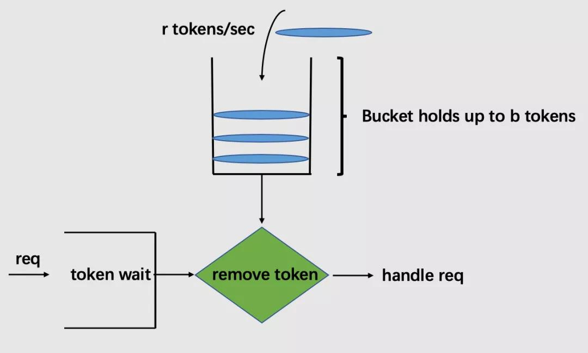

# 常见限流算法 

## 1. 概述

在开发高并发系统时，有三把利器用来保护系统：缓存、降级和限流。限流是指通过对并发访问/请求进行限速或者对一个时间内的的请求进行限量来保护系统，一旦达到限制条件则可以拒绝服务。

总体来说，实现限流有三种主流方式：**计数器，漏桶算法（leaky-bucket）和令牌桶算法（token-bucket）**。


## 2. 计数器

简单计数器是限流算法中最简单也是最容易实现的一种算法。


比如我们规定，对于接口A来说，1分钟的请求次数不能超过1000次。那么，设置一个请求计数器，将初始值设为0。当有请求进来时，会把计数器+1，如果在1分钟间隔以内计数器的值大于1000，说明请求数过多，对后续请求拒绝服务；当1分钟间隔后，重置计数器。


## 3. 漏桶算法

漏桶算法的思想比较好理解。


首先，我们有一个固定容量的桶，有水流进来，也有水流出去。我们无法预计一共有多少水会流进来，也无法预计水流入的速度。但是这个桶可以固定水流出的速度。而且，当桶满了之后，多余的水将会溢出。


uber 开源的 go 版本库

```sh
https://github.com/uber-go/ratelimit
```

部分代码如下:

```go
func (t *limiter) Take()  {
	// 1.首先获取当前时间
	now := t.clock.Now()
	// 2.获取需要 sleep 的时间 用每次请求的时间减去上次请求到现在经过的时间
	// 其中 perRequest 计算为 perRequest=time.Second / time.Duration(rate),
	t.sleepFor += t.perRequest - now.Sub(t.last)
	// 3. 最后就 sleep 一段时间
	if t.sleepFor > 0 {
		t.clock.Sleep(t.sleepFor)
	}
}
```

首先获取当前时间，然后


## 4. 令牌桶算法



首先，我们有一个固定容量的桶，桶里存放着令牌（token）。桶一开始是空的，token以一个固定的速率r往桶里填充，直到达到桶的容量，多余的令牌将会被丢弃。每当一个请求过来时，就会尝试从桶里移除一个令牌，如果没有令牌的话，请求无法通过。


go 语言 官方实现

`golang.org/x/time/rate`包下面。

部分代码如下:

```go
func reserveN(n int){
	// 1.计算当前的 token 数
	// 也是按时间计算 当前时间和上次请求的时间这中间的时候 又增加了多少 token 数。
	now, last, tokens := lim.advance(now)

	// 2.然后减去 当前需要消耗的 token 数
	tokens -= float64(n)

	// 3.然后如果减完是负数则计算一下多消耗的令牌需要多久才能生成出来
	// 另外一个 Wait 方法是阻塞的 这里算出来应该就是阻塞时间
	var waitDuration time.Duration
	if tokens < 0 {
		waitDuration = lim.limit.durationFromTokens(-tokens)
	}

	// 4.这里的 ok 就是最终返回的值 
	// 如果 需要消耗的令牌数直接都大于了桶容量(burst) 那肯定是 false
	// 如果 需要等待的时间 waitDuration 大于 指定时间(maxFutureReserve) 也是 false
	ok := n <= lim.burst && waitDuration <= maxFutureReserve
}
```


## 5. 漏桶算法与令牌桶算法区别

* **漏桶算法**的特定是匀速，因为桶的漏水速度是固定的，无法处理请求突增的情况。

* **令牌桶算法**则可以处理请求突增的情况。

总结: 漏桶算法和令牌桶算法的主要区别在于，`漏桶算法`能够强行限制数据的传输速率（或请求频率），而`令牌桶算法`在能够限制数据的平均传输速率外，还允许某种程度的突发传输。


常见的错误理解:

漏斗的原理里面也有水桶的概念呀，比如说水桶的大小是10，而rate是每秒2，那么在一瞬间我完全可以把水桶占满呀，后续会受到rate的限制，这不也是能够处理突增的情况吗？

最开始看到这两个算法的时候我也是这样理解的，漏桶算法不是也有桶嘛，如果桶是空的，那么请求突增的时候桶被填满了才会被限速？


正确理解:

漏桶中的桶容量指的是**排队容量**。

> 桶大小为 10，速率为每秒2个。一次性来 20 个请求，那么有10个请求都不带阻塞的，直接丢弃。进入桶中的10个请求按照设置的速率进行处理，第一秒处理2个，后面8个继续阻塞，第二秒接着在处理2 个。


令牌桶中的容量只**最大并发量**。

令牌桶是拿到令牌才会处理请求，桶大小为 10，速率为每秒2个。最开始或者一段时间没请求后 桶里肯定就存满了 10 个令牌，此时就能同时通过 10 个请求了。后续没令牌了所有请求都会阻塞，由于速率为 2，即每秒向桶里存入 2 枚令牌，那么后续就只能每秒通过 2 个请求。

