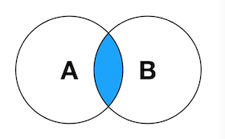
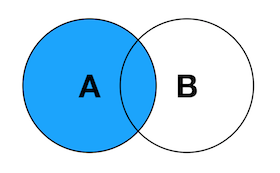
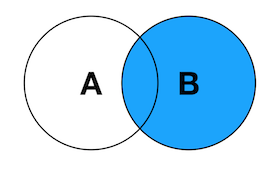
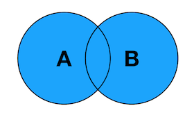
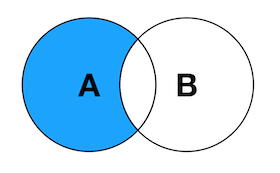
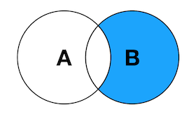
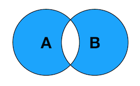

# SQL JOIN 详解

https://mp.weixin.qq.com/s/LfbSmwwDy5QkxXsicjMjLA

## 1. 概述

> 最近发现对 JOIN 概念并不是很清楚，于是网上查了查资料，看个一些博客，最后整理了一下。
>
> 大部分内容都来源于广大网友，仅做了整理。

SQL连接可以大致分为内连接、外连接。


## 2. INNER JOIN

`INNER JOIN` 一般译作`内连接`。内连接查询能将左表（表 A）和右表（表 B）中能关联起来的数据连接后返回。



基本语法如下:

```mysql
SELECT * FROM A INNER JOIN B ON xxx
```


### 1. EQUI JOIN

`EQUI JOIN` 通常译作`等值连接`。

在连接条件中使用**等于号`=`**运算符比较被连接列的列值，其查询结果中列出被连接表中的所有列，**包括其中的重复列**。

```mysql
# 隐式 INNER JOIN (使用逗号分隔多个表)
SELECT p.player_id, p.player_name,p.team_id, t.team_name FROM player AS p, team AS t WHERE p.team_id = t.team_id

# 显式 INNER JOIN
SELECT p.player_id, p.player_name,p.team_id,t.team_name FROM player AS p INNER JOIN team AS t ON p.team_id = t.team_id
```


### 2. NON EQUI JOIN

`NON EQUI JOIN` 通常译作`非等值连接`

在连接条件使用**除等于运算符以外的比较运算符**比较被连接的列的列值。这些运算符包括>、>=、<=、<、!>、!<和<>。

```mysql
SELECT p.player_name, p.height, h.height_level
FROM player AS p INNER JOIN height_grades AS h
on p.height BETWEEN h.height_lowest AND h.height_highest
```


### 3. NATURAL JOIN

`NATURAL JOIN` 通常译作`自然连接`，也是`EQUI JOIN`的一种，其结构使得具有相同名称的关联表的列将只出现一次。

在连接条件中使用**等于号`=`**运算符比较被连接列的列值，但它使用选择列表指出查询结果集合中所包括的列，**并删除连接表中的重复列**。

> 所谓自然连接就是在等值连接的情况下，当连接属性X与Y具有相同属性组时，把在连接结果中重复的属性列去掉。
>
> 自然连接是在广义笛卡尔积R×S中选出同名属性上符合相等条件元组，再进行投影，去掉重复的同名属性，组成新的关系。


## 3. OUTER JOIN

外连接包括 3 种：

* LEFT (OUTER ) JOIN 
* RIGHT  (OUTER ) JOIN
* FULL (OUTER ) JOIN

### 1. LEFT JOIN

`LEFT JOIN` 一般被译作左连接，也写作 `LEFT OUTER JOIN`。左连接查询会返回左表（表 A）中所有记录，右表中关联数据列也会被一起返回(不管右表中有没有关联的数据)。



基本语法如下:

```mysql
SELECT * FROM A LEFT JOIN B ON xxx
```

例如: 查询球员和队名。

```mysql
SELECT p.player_name,t.team_name FROM player AS p LEFT JOIN team AS t ON p.team_id = t.team_id
```

### 2. RIGHT JOIN

`RIGHT JOIN` 一般被译作`右连接`，也写作 `RIGHT OUTER JOIN`。右连接查询会返回右表（表 B）中所有记录，左表中找到的关联数据列也会被一起返回(不管左表中有没有关联的数据)。



基本语法如下:

```mysql
SELECT * FROM A RIGHT JOIN B ON xxx
```

例如: 查询球员和队名。

```mysql
SELECT p.player_name,t.team_name FROM player AS p RIGHT JOIN team AS t ON p.team_id = t.team_id
```


> LEFT JOIN 和 RIGHT JOIN 是可以转换的，主要还是根据需求来。

### 3. FULL JOIN

`FULL JOIN` 一般被译作`全连接`，在某些数据库中也叫作 `FULL OUTER JOIN`。 外连接查询能返回左右表里的所有记录，其中左右表里能关联起来的记录被连接后返回。



基本语法如下:

```mysql
SELECT * FROM A FULL OUTER JOIN B ON xxx
```

例如

```mysql
SELECT p.player_name,t.team_name FROM player AS p FULL JOIN team AS t ON p.team_id = t.team_id
```

> 当前 MySQL 还不支持 FULL OUTER JOIN,不过可以通过 LEFT JOIN+ UNION+RIGHT JOIN 实现。

## 4. 延伸用法

### 1. LEFT JOIN EXCLUDING INNER JOIN

返回左表有但右表没有关联数据的记录集。



例如:

```mysql
SELECT * FROM A INNER JOIN B ON A.id = B.id WHERE B.id IS NULL
```

主要是通过`ON`后面的`WHERE`条件进行过滤。


返回右表有但左表没有关联数据的记录集。



例如:

```mysql
SELECT * FROM A INNER JOIN B ON A.id = B.id WHERE A.id IS NULL
```

> 同 LEFT JOIN EXCLUDING INNER JOIN 只是改变了 WHERE 条件。


### 3. FULL OUTER JOIN EXCLUDING INNER JOIN

返回左表和右表里没有相互关联的记录集。


例如:

```mysql
SELECT * FROM A FULL OUTER JOIN B ON A.id = B.id WHERE A.id IS NULL OR B.id IS NULL
```


## 5. 其他 JOIN

除以上几种外，还有更多的 JOIN 用法，比如 CROSS JOIN（迪卡尔集）、SELF JOIN(自连接)，

### 1. CROSS JOIN

返回左表与右表之间符合条件的记录的迪卡尔集。

基本语法如下:

```mysql
SELECT * FROM player CROSS JOIN team
```

> 需要注意的是 CROSS JOIN 后没有 ON 条件。


**实际上 CROSS JOIN 只是 无条件 INNER JOIN 的 专用关键字而已**


### 2. SELF JOIN

就是和自己进行连接查询，给一张表取两个不同的别名，然后附上连接条件。

比如:

我们想要查看比布雷克·格里芬高的球员都有谁，以及他们的对应身高。

正常情况下需要分两步完成：

* 1）找出布雷克·格里芬的身高信息

```mysql
SELECT height FROM player WHERE player_name =  '布雷克-格里芬'
```

* 2）根据 1 中的身高 查询出对应球员。

```mysql
SELECT player_name, height FROM player WHERE height > xxx
```

或者使用子查询

```mysql
SELECT player_name, height FROM player WHERE height > (SELECT height FROM player WHERE player_name =  '布雷克-格里芬')
```


同样的使用自连接一样可以完成该需求。

```mysql
SELECT b.player_name, b.height FROM player AS a INNER JOIN player AS b ON a.player_name = '布雷克-格里芬' AND a.height < b.height
```

`FROM player AS a INNER JOIN player AS b ` 这样就生成了两个虚拟表进行 INNER JOIN。

然后通过`ON`和`WHERE`两个条件`ON a.player_name = '布雷克-格里芬' AND a.height < b.height` 找到想要的记录。


## 6. 小结

以上七种用法基本上可以覆盖各种 JOIN 查询了。

> 这个图忘了是哪儿找到的了


还有另外一个版本的,作者为[C.L. Moffatt](https://www.codeproject.com/script/Membership/View.aspx?mid=5909363)


## 7. 参考

`https://dev.mysql.com/doc/refman/8.0/en/join.html`

`https://www.zhihu.com/question/34559578`

`https://coolshell.cn/articles/3463.html`

`https://www.w3resource.com/slides/sql-joins-slide-presentation.php`

`https://www.cnblogs.com/zxlovenet/p/4005256.html`

`https://www.w3school.com.cn/sql/sql_union.asp`

`https://mazhuang.org/2017/09/11/joins-in-sql`