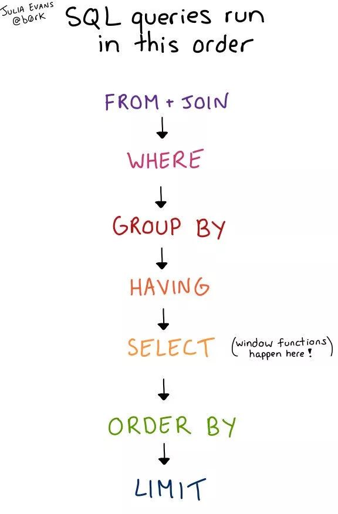

## SELECT的执行顺序

### 1. 概述

1.关键字的顺序是不能颠倒的：

```mysql
SELECT ... FROM ... WHERE ... GROUP BY ... HAVING ... ORDER BY ...
```

2.SELECT语句的执行顺序（在MySQL和Oracle中，SELECT执行顺序基本相同）：

```mysql
FROM > WHERE > GROUP BY > HAVING > SELECT的字段 > DISTINCT > ORDER BY > LIMIT
```



### 2. 分析

比如你写了一个SQL语句，那么它的关键字顺序和执行顺序是下面这样的：

```mysql
SELECT DISTINCT player_id, player_name, count(*) as num #顺序5
FROM player JOIN team ON player.team_id = team.team_id #顺序1
WHERE height > 1.80 #顺序2
GROUP BY player.team_id #顺序3
HAVING num > 2 #顺序4
ORDER BY num DESC #顺序6
LIMIT 2 #顺序7
```

**在SELECT语句执行这些步骤的时候，每个步骤都会产生一个虚拟表，然后将这个虚拟表传入下一个步骤中作为输入**。需要注意的是，这些步骤隐含在SQL的执行过程中，对于我们来说是不可见的。

我来详细解释一下SQL的执行原理。

首先，你可以注意到，SELECT 是先执行`FROM`这一步的。在这个阶段，如果是多张表联查，还会经历下面的几个步骤：

* 1) 首先先通过CROSS JOIN求笛卡尔积，相当于得到虚拟表 vt（virtual table）1-1；
* 2) 通过ON进行筛选，在虚拟表vt1-1的基础上进行筛选，得到虚拟表 vt1-2；
* 3) 添加外部行。如果我们使用的是左连接、右链接或者全连接，就会涉及到外部行，也就是在虚拟表vt1-2的基础上增加外部行，得到虚拟表vt1-3。

当然如果我们操作的是两张以上的表，还会重复上面的步骤，直到所有表都被处理完为止。这个过程得到是我们的原始数据。

当我们拿到了查询数据表的原始数据，也就是最终的虚拟表vt1，就可以在此基础上再进行`WHERE`阶段。在这个阶段中，会根据vt1表的结果进行筛选过滤，得到虚拟表vt2。

然后进入第三步和第四步，也就是`GROUP`和 `HAVING`阶段。在这个阶段中，实际上是在虚拟表vt2的基础上进行分组和分组过滤，得到中间的虚拟表vt3和vt4。

当我们完成了条件筛选部分之后，就可以筛选表中提取的字段，也就是进入到`SELECT`和`DISTINCT`阶段。

首先在 SELECT 阶段会提取想要的字段，然后在 DISTINCT 阶段过滤掉重复的行，分别得到中间的虚拟表vt5-1和vt5-2。

当我们提取了想要的字段数据之后，就可以按照指定的字段进行排序，也就是`ORDER BY`阶段，得到虚拟表vt6。

最后在vt6的基础上，取出指定行的记录，也就是`LIMIT`阶段，得到最终的结果，对应的是虚拟表vt7。

当然我们在写SELECT语句的时候，不一定存在所有的关键字，相应的阶段就会省略。

> 同时因为SQL是一门类似英语的结构化查询语言，所以我们在写SELECT语句的时候，还要注意相应的关键字顺序，所谓底层运行的原理，就是我们刚才讲到的执行顺序。

### 3. 疑问


**问题**

既然HAVING的执行是在SELECT之前的，那么按理说在执行HAVING的时候SELECT中的count(*)应该还没有被计算出来才对啊，为什么在HAVING中就直接使用了num>2这个条件呢？

**解答**

实际上在Step4和Step5之间，还有个聚集函数的计算。
如果加上这个计算过程，完整的顺序是：
1、FROM子句组装数据
2、WHERE子句进行条件筛选
3、GROUP BY分组
4、使用聚集函数进行计算；
5、HAVING筛选分组；
6、计算所有的表达式；
7、SELECT 的字段；
8、ORDER BY排序
9、LIMIT筛选
所以中间有两个过程是需要计算的：聚集函数 和 表达式。其余是关键字的执行顺序，如文章所示。